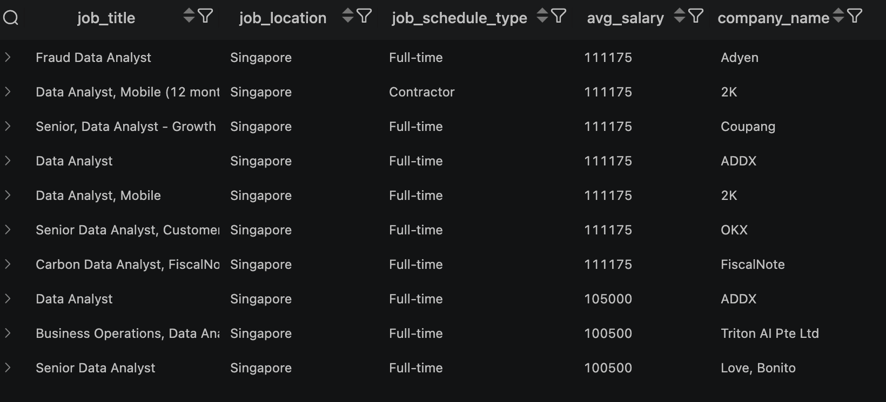
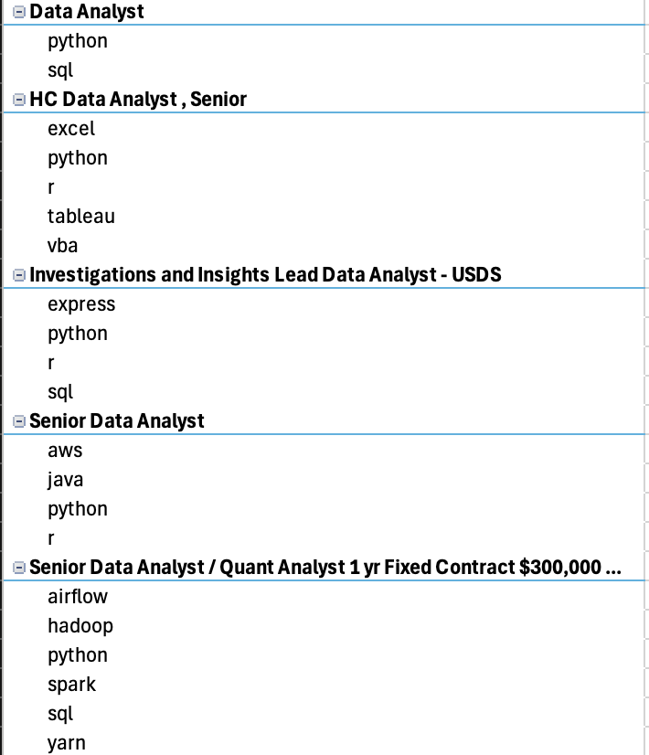
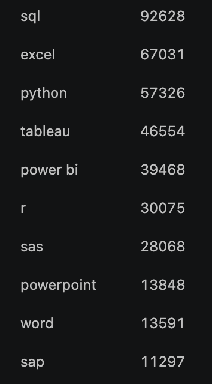
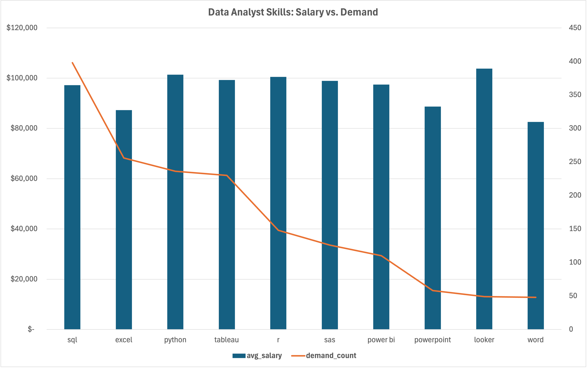

# SQL Data Analyst Job Research

## 📖 Introduction
This project analyzes the global Data Analyst job market using PostgreSQL, focusing on remote work (WFH) trends, required skills, salary distributions, and geographic benchmarks.

---

## 📂 Project Structure
```text
SQL_Data_Analyst_Job_Research/
│
├── sql_load/        # Database schemas, table creation, and CSV import scripts
└── sql_queries/     # SQL queries for job market analysis
```

---

## 📊 Key Findings & Visualizations

### 1. Top Paying Data Analyst Roles in Singapore


- **Wide Salary Range:** Top-paying data analyst roles reach up to $111,175, indicating significant salary potential.
- **Diverse Employers:** Companies like Coupang, Adyen, OKX, Love, Bonito, and 2K offer these competitive salaries.

---

### 2. Required Skills for Top-Paying Data Analyst Roles Worldwide
  
*Note: Chart built in Microsoft Excel*

---

### 3. Most In-Demand Skills for Data Analyst Roles Worldwide


- SQL and Excel remain fundamental skills for data analysts globally.
- Programming and visualization tools like Python, Tableau, and Power BI are essential top-tier tools.

---

### 4. Skills in High Demand and Associated Average Salaries for WFH Roles

*Note: Chart built in Microsoft Excel*
---

## 📌 Conclusion

* This project improved my SQL skills and provided insights into the data analyst job market.
* The findings help guide skill development and job search priorities.
* Focusing on high-demand and high-salary skills helps aspiring data analysts compete effectively.
* Continuous learning and adaptation to trends are essential in data analytics.
